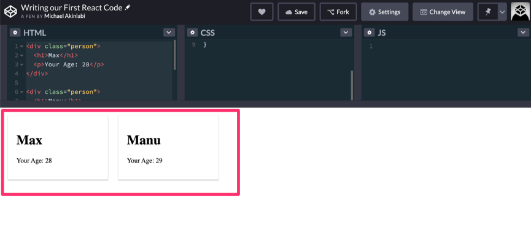
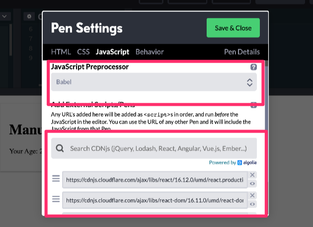

# Writing our First React Code
- We're going to be writing code in CodePen. CodePen allows us to write HTML, CSS and JavaScript. We can also use it as a playground to see how our code works.
- In the code editor you can quickly create a div by writing `div` and hitting tab on your keyboard.
- Here's the link to the code pen: https://codepen.io/akinlabi/pen/OJPmRMK
- We write the HTML
- Then we also style it with CSS
- After styling with the below code, we have a card like data:
```css
.person {
	border: 1px solid #eee;
	box-shadow: 0 2px 2px #ccc;
	width: 200px;
	padding: 20px;
}
```
- Then we added this to the above code to make it look even cooler.
```css
	display: inline-block;
	margin: 10px;
```
- The above code would make it look even cooler.
- Then we can replicate it to two person cards.
```html
	<div class="person">
		<h1>Max</h1>
		<p>Your Age: 28</p>
	</div>

	<div class="person">
		<h1>Manu</h1>
		<p>Your Age: 29</p>
	</div>
```
- Now, the cards become two.

- The problem here is that we're always writing the person `div` to add more person cards
- What if we see the person `div` as a component?
- Just the data in it that varies
- We can use React to create these reusable components
- Let's add it
- In the CodePen, in the JS area, you have to import React
- Click the setting icon in the JS area, and there you can import an external library like React
- It's so popular that you can search for it there and it will show. Add it. 
- You also need to add React DOM. 
- React is about creating the components. React DOM is about rendering these components to the real DOM.
- React uses a special JavaScript syntax and the next generation JavaScript features.
- To unlock the features and the usage of these syntax, in the JavaScript preprocessor box in CodePen, on the same place as where you add `React` and `React DOM`, you should click on the dropdown and select Babel.

- Now, let's create a React component.
- Make sure it starts with a capital letter.
- The React component is a normal function but it has to return the code you want it to render to the `DOM`
- This is where React uses a special syntax called JSX. Author uses parentheses to be able to return some multi-line code. 
```js
function Person() {
  return (
  
  );
}
```
- Now copy one person `div` and paste it into that space.
```js
	function Person() {
		return (
			<div class="person">
				<h1>Max</h1>
				<p>Your Age: 28</p>
			</div>
		);
	}
```
- Of course, this is just a function. To actually turn it into a React component, we have to render it to the screen. 
- Now get rid of the first `person` `div` and replace it with a `div` with an `id` of `p1`
```js
<div id="p1"></div>

<div class="person">
  <h1>Manu</h1>
  <p>Your Age: 29</p>
</div>
```
- Now write this method in JS.
```js
ReactDOM.render();
```
- This method allows us to render a JS function as a component to the real `DOM`
```js
ReactDOM.render(<Person />, document.querySelector('#p1'));
```
- Now we're telling the ReactDOM where to render that function. Wow. It's rendered.
- You can add arguments to your component by using `props`
