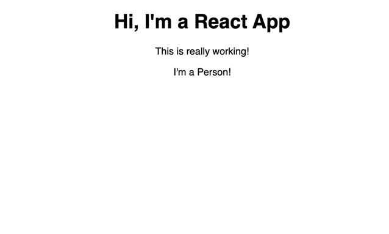

# Creating a Functional Component
- https://github.com/MBAkinlabi/my-app/commit/9d84d198bc599a40f6bec66cdbbe136befa71e6f
- React is all about components. It makes it easy to build components.
- Time to use more components
- Add a new folder to our `src` folder and name it `Person`. Start with capital P. It's the convention in React. 
- Inside that new `Person` folder, create a `Person.js` file.
- That is following the conventional of starting with a capital letter. And describing what the component is about through its name.
- In the `Person.js` file, we want to create a component. 
- Well we've already did that in the `App.js` file. Like we extended the `Component` class from the `React` library.
- We can use this approach and it's important when you learn about states which allows you to change your component at run time.
- Most of the time you should use a different form of creating component  -- a simple JS function. Because in it's simple form, a component is just a function which returns some JSX
- You could write it like this:
```js 
function person() {
    rerturn <h2>
}
```
- You could also use the ES5 way of creating a variable function
```js
var person = function() {
    
}
```
- We would use the ES6 version here, and it's highly recommended that you do it that way.
- We would create a variable using the `const` keyword because we don't plan on changing it.
- We name it `person` with a lowercase character. You can use the uppercase. but you often see the function name being lowercase. 
- It should be the same name as your file name though or as the component name you want to use. 
```js
const person = () => {

};
```
- We used the arrow function syntax. 
- It has some advantages especially when we use the `this` keyword.
- Let's return some JSX in this function or component.
```js
const person = () => {
    return <p>I'm a Person!</p>
};
```
- We need to do some other things.
- We need to import React from the react package.
```js
import React from 'react';

const person = () => {
    return <p>I'm a Person!</p>
};
```
- We don't need the component though because here we're not using a class which extends the `component`
- Instead we're creating a function. 
- We still need to export the default of this file. 
```js
import React from 'react';

const person = () => {
    return <p>I'm a Person!</p>
};

export default person;
```
- Now we can start using this component.
- Go to the main only component. Our root component at `App.js`
- Now, I'll import `Person` (the name is totally up to you though), but it should be the name of your component starting with a capital letter. And import it the file. You can omit using `.js` because it's added automatically.
```js
import React, { Component } from 'react';
import './App.css';
import Person from './Person/Person';
```
- Your component should start with a capital character because in React (JSX) all characters starting with lowercase characters like `div` `h1` are reserved for the native `html` elements.
- You could create your own component which you'll name `Div` starting with uppercase `D`
- React could use that because it won't interfere with the normal `div`
```js
<div className="App">
        <h1>Hi, I'm a React App</h1>
        <p>This is really working!</p>
      </div>
      <Div></Div>
```
- Remove the <Div> you just added.
- For the same reason, you should give your `Person` uppercase character so that React sees it as a custom component. 
- So let's use `<Person></Person>` here. We can even use the opening and closing tag.
```js
<div className="App">
        <h1>Hi, I'm a React App</h1>
        <p>This is really working!</p>
        <Person></Person>
      </div>
```
- Or, since we don't nest anything between, you can also use a self-closing tag. `<Person />`
```js
<div className="App">
        <h1>Hi, I'm a React App</h1>
        <p>This is really working!</p>
        <Person />
      </div>
```
- If you save that and go to your browser. you'll see this.

- This is now coming from our own component.
- In the end, we don't see custom element. We just see the parent reference, which is of course `App`
- What's the benefit of writing it like this?
- Join me in the next lecture to see the benefit.