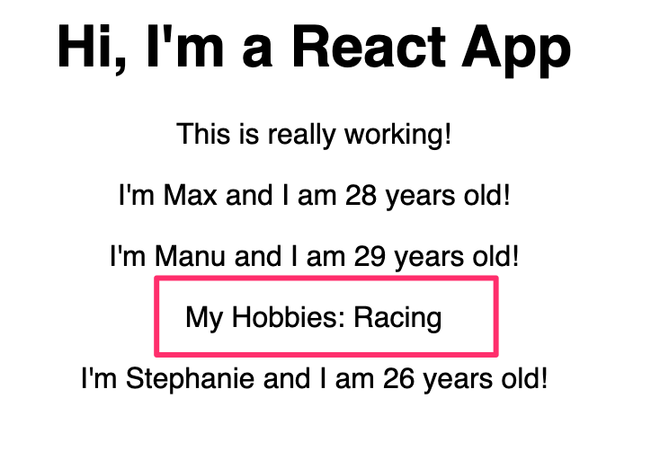

# Understanding the Children Property
- https://github.com/MBAkinlabi/my-app/commit/4510c4c14a05855f6f8ab867aab19dc7e50fb387
- We learned how to use `props` in the last lecture.
- Now we want to also learn how to output whatever we passed between the opening and closing of our custom component.
- There's a special prop that React gives us access to.
- Go to the `Person.js` file (Person component) and wrap the paragraph in normal parentheses like this so that we can write this over multiple lines.
```js
const person = (props) => {
    return (
    <p>I'm {props.name} and I am {props.age} years old!</p>
    )
};
```
- Now we now want to create a wrapping element. Simply a `div` and we want to wrap the paragraph inside of the `div` and add another element after this paragraph
```js
const person = (props) => {
    return (
        <div>
            <p>I'm {props.name} and I am {props.age} years old!</p>
        </div>
    )
};
```
- This other element should also be a paragraph maybe. But it should be the pagraph that outputs the what we pass between the opening and closing tags
- We can use single curly braces to output something dynamic. Accessing `props.children` property.
```js
const person = (props) => {
    return (
        <div>
            <p>I'm {props.name} and I am {props.age} years old!</p>
            <p>{props.children}</p>
        </div>
    )
};
```
- This is a reserved word. We didn't pass anything as children on our persons. We only passed name and age.
- Childrens refers to any element, and it includes the plain text that we have between the opening and closing tags `My Hobbies: Racing` as we have it here. Remember that inside that opening and closing tag of your component, you can even nest complex `html` code in between too.
- It doesn't have to be just text.
- It can be an unordered list with multiple items. It could even be other React components. Anything can go between those opening and closing tags.
- This children are now output with this syntax `props.children`. And of course you don't have to wrap in it in a paragraph.
- You can use it anywhere in your JSX code.
- And after saving this, you'll see it on the screen

- You'll notice that others without the content between the tags still output normally. But if you inspect it in Dev tools, you'll see empty paragraphs which are space for the children. But they didn't have it of course. so the paragraph is empty.
-  Their props.children is basically undefined or null because we have nothing there.
- This is important to know.
- You can put your content into component from outside. Not only by passing props like `name="Manu"` and `age="29"`. But if you want to pass some structured `html` content, by placing it between the opening and closing tags. And accessing it with `props.children`