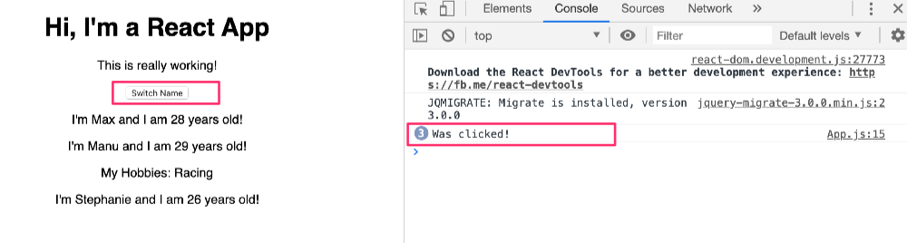

# Handling Events with Methods
- https://github.com/MBAkinlabi/my-app/commit/4b80b06153e791f502f6ed6c8eae993eb7940105
- Let's now handle a click on the `Switch Name` button inside the `App.js` file.
- We do that by adding `onClick`. In normal JS, it's lowercase `onclick`. The `c` is lowercase. In JSX, it's capital `C`
- Then we assign it a value `=`, then we use curly braces to execute some dynamic code.
- Typically, you want to execute a function (method) of your class. In this case the `App` class inside the `App.js` file.
```js
<button onClick={} >Switch Name</button>
```
- Inside the class, you can create a method with the name like `switchNameHandler`.
- According to convention, the first part `switchName` is totally up to you. You can give the first part any name you want.
- But it's very important to use `Handler` at the end of the method. You do this to indicate that this is a method you're not actively calling, but you're assigning as an event handler.
- It's a good practice to name it like that. It's not a must you follow it.
- You can say something like `switchNameHandler =` to assign it to a method like that inside the App class.
```js
switchNameHandler = () => {

  }
```
- And there, you now want to edit your `state`
- But before you do that, let's see if you can call this successfully.
- We can say console log `Was clicked!` so that we can see when we click it in the console.
```js
switchNameHandler = () => {
    console.log('Was clicked!');
  }
```
- Now, go to your click listener and  between the curly braces which you've written, and you can write `this.switchNameHandler` and don't add parentheses.
- For example, don't write `()` in front of it there. By adding it, React will execute it immediately when it loads.
- We only want to pass a reference, we do that by using `this.switchNameHandler`
```js
<button onClick={this.switchNameHandler}>Switch Name</button>
```
- It's important to note this:
- If you don't use the syntax as written to create the `switchNameHandler` method, where you assign a function to a property, you'll run into errors if you try to use `this` inside the method because it's not the way things work in ES6. 
- By using the ES6 syntax to create your method you circumvent this problem.
- Don't add parenthese to `this.switchNameHandler` Write it like I did.
- Save the file and open the console in the developer tools.
- Click on the `Switch Name` button and you should see `Was Clicked!` in the Console.

- Now, let's also change the state. We'll do that in the next lecture. 