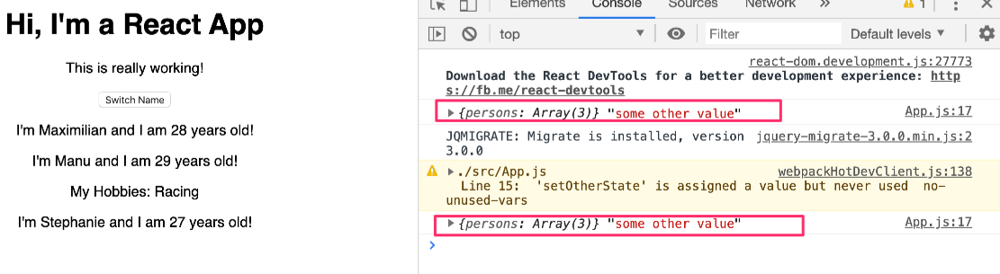

# Using the useState() Hook for State Manipulation
- https://github.com/MBAkinlabi/my-app/commit/bd4265bfbe37a2bc7c797cf4b195bb2c4385e9c4
- Prior to React version 16.8, the way you've learned was the only way of managing state in React applications.
- And it's still the way we use throughout this course. I'll come back to why in a second.
- Now since React 16.8, there's also a way for us to manage state in functional component with a feature called React hooks.
- I'll show you this feature here already, and actually in this course there are two complete modules on React Hooks.
- One we teach us from the ground up. And one that converts the entire course project to use React Hooks.
- And the reason why we need to convert that is because for this course I'll stick to the set up, traditional set up where you use class-based components for managing state even though since React 16.8 we could also use function components for everything.
- Why we're sticking to this set up is because it's been the only way in the past. You'll work with this syntax if you're just joining a company using React. It's the established syntax
- This new way with React Hooks is totally optional. And it's not even sure if it'll be the main way of creating components in the future.
- Therefore you'll learn both in this course.
- We'll use this established way here, which is the default way of creating components in React.
- Below was what the instructor was highlighting as the way. I guess it's the state management thing:
```js
class App extends Component {
  state = {
    persons: [
      { name: 'Max', age: 28 },
      { name: 'Manu', age: 29 },
      { name: 'Stephanie', age: 26 }
    ],
    otherState: 'some other value'
  }
```
- The highlighting started from the `state` till the end.
- Instructor will introduce Hooks as they make sense here and other modules.
- Let me show you how this React Hooks looks like.
- React Hooks is just a name. It's basically a collection of functions exposed to you by React.
- Therefore it means we have to convert the the class `App` component into a function one.
- Replace it with a `const` named `app`. It gets `props` and has a function body just as we have it in `Person.js` file.
```js
const app = props => {
```
- We now no longer have `state` or `switchNameHandler`. Cut that temporarily and put it at the bottom so that we can later reuse that logic.
- You should export `default` `app` by changing from uppercase to lowercase because we renamed the `app` to lowercase and change it to `const` too. 
```js
export default app;
```
- Then in your function body, you have no `render()`, you just `return` `JSX`. Remove `render()`
- That's how functional components works.
- And now you can use React Hooks feature. One of them actually. It has to be React 16.8 or higher. 
- You use React Hooks by importing them from React. Instead of `Component`, which you don't need anymore, you can import `use` (All these Hooks start with the `use` keyword) and you'll see that there're a couple of Hooks. type in `useState`
```js
import React, { useState } from 'react';
import './App.css';
import Person from './Person/Person';
```
- `useState` is the most important React Hooks. And I'll introduce other hooks throughout this course.
- `useState` is a Hook that allows us to manage state in a functional component.
- How you use it? You can it like a function like this inside the `const app` function. 
```js
const app = props => {
  
  useState();
```
- And to use `useState`, you pass in your initial state into the function. Copy the object you previously set up on your `state` property
```js
const app = props => {

  useState({
    persons: [
      { name: 'Max', age: 28 },
      { name: 'Manu', age: 29 },
      { name: 'Stephanie', age: 26 }
    ],
    otherState: 'some other value'
  });
```
- Make sure you remove the `state` property after doing this.
- What happens now is that the `useState` returns an array with exactly two elements. Always two elements. That's important.
- You can store this in a `stateArr` const.
```js
const app = props => {

  const stateArr = useState({
    persons: [
      { name: 'Max', age: 28 },
      { name: 'Manu', age: 29 },
      { name: 'Stephanie', age: 26 }
    ],
    otherState: 'some other value'
  });
```
- Now the first element we get back we always be our current state. Initially that object and whenever we changed it, we get the update state.
- The second element in `stateArr` will always be a function that allows us to update this state and will rerender this component.
- You can use a modern JS feature called array destructuring. Here's what we want to destructure:
```js
const stateArr = useState({
```
- We know `useState` has the second function so we want to get that.
- Now it's this now:
```js
const [] = useState({
```
- So the first one in the bracket is `personsState` (the name is up to you) and the second is element would be `setPersonsState` which is a function. remember?
```js
const [ personsState, setPersonsState ] = useState({
```
- Now we have these two things: `personsState` gives you access to the object. This one below:
```js
persons: [
      { name: 'Max', age: 28 },
      { name: 'Manu', age: 29 },
      { name: 'Stephanie', age: 26 }
    ],
    otherState: 'some other value'
  });
```
- Now, we go to the JSX code and make sure we reflect the change.
```js
return (
      <div className="App">
        <h1>Hi, I'm a React App</h1>
        <p>This is really working!</p>
        <button onClick={this.switchNameHandler}>Switch Name</button>
        <Person name={this.state.persons[0].name} age={this.state.persons[0].age} />
        <Person name={this.state.persons[1].name} age={this.state.persons[1].age} >My Hobbies: Racing</Person>
        <Person name={this.state.persons[2].name} age={this.state.persons[2].age} />
      </div>
    );
```
- We should now replace `this.state` to complete with `personsState`
```js
return (
      <div className="App">
        <h1>Hi, I'm a React App</h1>
        <p>This is really working!</p>
        <button onClick={this.switchNameHandler}>Switch Name</button>
        <Person name={personsState.persons[0].name} age={personsState.persons[0].age} />
        <Person name={personsState.persons[1].name} age={personsState.persons[1].age} >My Hobbies: Racing</Person>
        <Person name={personsState.persons[2].name} age={personsState.persons[2].age} />
      </div>
    );
```
- the `this.state` doesn't exist anymore. It only exist in class-based components and we have no such. It's now a functional component.
- `setPersonsState` allows us to set a new state.
- We can readd our `switchNameHandler` to our component. But how do we add a method as this was before to a functional component?
- Well, you can have functions inside functions. Not just React. In JS in general.
- Add the property `switchNameHandler` and take the code and add it there inside the function component.
```js
const app = props => {

  const [ personsState, setPersonsState ] = useState({
    persons: [
      { name: 'Max', age: 28 },
      { name: 'Manu', age: 29 },
      { name: 'Stephanie', age: 26 }
    ],
    otherState: 'some other value'
  });

  const switchNameHandler = () => {
    // console.log('Was clicked!');
    // DON'T DO THIS: this.state.persons[0].name = 'Maximilan';
    this.setState({
      persons: [
        { name: 'Maximilian', age: 28 },
        { name: 'Manu', age: 29 },
        { name: 'Stephanie', age: 27 }
      ]
    } )
  }
```
- Now you have a functional component that can manage state and can have other functions that do something. For example, this function you just added do something on a click.
- That's exactly what you do on this line of code using that function
```js
<button onClick={this.switchNameHandler}>Switch Name</button>
```
- Remove the `this` because in fact we're not inside a class anymore.
```js
<button onClick={switchNameHandler}>Switch Name</button>
```
- Inside the `const switchNameHandler` we also won't call `this.setState` anymore because it doesn't exist.
- Replace it with `setPersonsState`
```js
setPersonsState({
      persons: [
        { name: 'Maximilian', age: 28 },
        { name: 'Manu', age: 29 },
        { name: 'Stephanie', age: 27 }
      ]
    } )
```
- Remember that we passed our new set state into there
- If you save it and go to the browser, you'll see that it's working real good.
- If you press the `Switch Name` button on the browser, you'll see that it'll change. It's working normally again. Wow.
- There's one important difference to the class-based component. It looks like it works the same. Well, it doesn't
- Let me console log `personsState` so that we can see what's inside.

```js
console.log(personsState); // #

  const switchNameHandler = () => {
    // console.log('Was clicked!');
    // DON'T DO THIS: this.state.persons[0].name = 'Maximilan';
    setPersonsState({
```
- If you save it and go to the browser. 
- If you reload and go the Developer Tools in the browser, you'll see that it's an object, which also includes `otherState`
- If you click the `Switch Name` button, you'll get new state and `otherState` would be missing. 
- And that is super important. When you're using React Hooks. your function here (instructor pointing to the `setPersonsState`), which you get as the second element of that array from `useState`, it doesn't merge whatever you pass in the new state with the old state. Instead it replaces the old state with it.
- This means that whenever you're updating state like this, you have to manually make sure you include all old state data.
- Here for example, by manually adding the `otherState` and access the `personsSate.otherState`
```js
 setPersonsState({
      persons: [
        { name: 'Maximilian', age: 28 },
        { name: 'Manu', age: 29 },
        { name: 'Stephanie', age: 27 }
      ],
      otherState: personsState.otherState // new
    } )
  }
```
- This will just make sure we copy the old untouched other state. Of course you can change it there too if you want to.
- Now if you go back to the console and click `Switch Name` the `otherState` would be there. 
- This is one way of doing it. But the most elegant way is to not manually merge your state but instead use `useState` multiple times. Whereas in class-based components, you only have one state property and and this set state automatically merges changes with the old state to not discard any state.
- Below `useState` you can call `useState` again and there if we want to manage our `otherState`, we can pass in our `otherState: 'some other value` object there. Or, if all we want to manage is a string, we could also just pass in that string as the default value. It doesn't have to be an object. It could anything (a boolean, array and so on)
```js
const [ personsState, setPersonsState ] = useState({
    persons: [
      { name: 'Max', age: 28 },
      { name: 'Manu', age: 29 },
      { name: 'Stephanie', age: 26 }
    ],
    otherState: 'some other value'
  });

  useState({otherState: 'some other value'}); // new

  console.log(personsState);

  const switchNameHandler = () => {
    // console.log('Was clicked!');
    // DON'T DO THIS: this.state.persons[0].name = 'Maximilan';
    setPersonsState({
      persons: [
        { name: 'Maximilian', age: 28 },
        { name: 'Manu', age: 29 },
        { name: 'Stephanie', age: 27 }
      ]
    } )
  }
```
- And you can have as many `useState` calls as you want. 
- And now it's changed to this for the authors explanation:
```js
 const [ personsState, setPersonsState ] = useState({
    persons: [
      { name: 'Max', age: 28 },
      { name: 'Manu', age: 29 },
      { name: 'Stephanie', age: 26 }
    ],
    otherState: 'some other value'
  });
  
  useState('some other value'); // edited
```
- Now if you log your `personsState` and you also extract that into
- You can separate that with the help of array destructuring.
```js
const [otherState, setOtherState] = useState('some other value');
```
- Now if you log your `personsState` and `otherState` and you never use `setOtherState` because you don't want to set it anywhere.
- Now if you log both to use `useState` calls.
```js
const [otherState, setOtherState] = useState('some other value');

  console.log(personsState, otherState); // Edited
```
- Back in the app (instructor changed something a mistake) remove `otherState`
```js
const [ personsState, setPersonsState ] = useState({
    persons: [
      { name: 'Max', age: 28 },
      { name: 'Manu', age: 29 },
      { name: 'Stephanie', age: 26 }
    ]
  });
```
- Now go back and reload the app.
- Now we have the persons state which is just an object and then we have our `some other value` string too. 
- And click on the `Switch Name` button, we updated persons and we still have our `some other value` string because that state wasn't touched by our call to set persons.

- So multiple `useState` with different state slices, that is how you manage state in a functional component with React Hooks.
-  We don't have one big state object, though we could, instead you have multiple state slices. 
-   This is a glimpse of React Hooks in general. And this is the most important React Hook.
- To summarize it, React Hooks is all about this `use` something functions refering to this when we imported
```js
import React, { useState } from 'react';
```
- Just referred to it. not touched.
- `useState` being the most important of them all. that allows you to add functionality to functional component
- So if you're using React Hooks only, you don't need to use class-based components.
- Still as I mentioned, I'll use class-based components because that's the established way. It's the way you'll need in any job you're starting.
- If you want to become a React developer, you have to know that name
- Still, you'll also learn this React Hooks syntax along the way.
- There are two complete modules towards the end of this course. In one module, I walked through all the important React Hooks. so that we have them all in one place.
- And in the other module, I'll take that React project (everything built in this course) and covert them to use React Hooks.  So that you're well prepared for whichever project we're diving into.
- At the end of this lecture. There's a rollback. You're only having this for reference. So make sure you take the rollback because we want to continue using the class-based approach. 